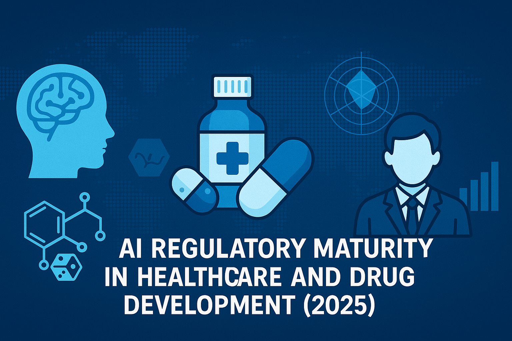

# AI Regulatory Maturity in Healthcare and Drug Development (2025)
 

This repository contains an analytical study focused on the regulatory maturity of Artificial Intelligence (AI) systems in the healthcare sector as of 2025. The analysis is presented through a Jupyter Notebook and supported by a structured Excel dataset.

---

## 📊 Contents

- `AI_Reg_Maturity_Healthcare_2025.ipynb`:  
  A Jupyter Notebook presenting exploratory data analysis, regulatory maturity scoring, visualization of global trends, and policy gaps in AI deployment in healthcare.

- `AI_Reg_Maturity_Healthcare_2025.xlsx`:  
  The structured dataset used for the analysis, including country-level indicators of AI readiness, health system maturity, legal frameworks, and ethical guidelines.

---

## 🧠 Purpose

This project aims to:

- Evaluate how mature various countries and regions are in regulating AI in healthcare.
- Identify gaps in regulation versus AI adoption.
- Provide data-driven insights to policymakers, industry stakeholders, and researchers.

---

## 📈 Methodology

The maturity assessment model includes the following dimensions:

1. **Regulatory Infrastructure**  
2. **Data Governance & Privacy Compliance**  
3. **AI Risk Management Protocols**  
4. **Transparency & Explainability Requirements**  
5. **Ethical Oversight Mechanisms**  

Scores were normalized, weighted, and visualized to assess trends and outliers.

---

## 📌 Key Features

- Interactive visualizations via `matplotlib`, `seaborn`, and `plotly`
- Automated maturity scoring algorithm
- Gap analysis between AI adoption and regulation maturity
- Exportable outputs and reproducible code

---

## 🚀 How to Use

1. Clone the repository:
   ```bash
   git clone https://github.com/your-username/AI_Reg_Maturity_Healthcare_2025.git
   cd AI_Reg_Maturity_Healthcare_2025

📚 Citation
If you use this work for research or publication, please cite as:

"AI Regulatory Maturity in Healthcare (2025)", [Montefusco-Pereira], 2025. GitHub Repository: https://github.com/your-username/AI_Reg_Maturity_Healthcare_2025

📄 License
This project is licensed under the MIT License. See LICENSE for details.

🧭 Related Work
WHO AI Ethics Guidance
OECD AI Principles
EU AI Act 2025 Updates

👤 Author
[Carlos Victor Montefusco Pereira]
Healthcare Data Scientist | Policy Researcher

GitHub: @camontefusco

LinkedIn: [linkedin.com/in/carlos-montefusco-pereira-dr-he-him-ab663221/]
